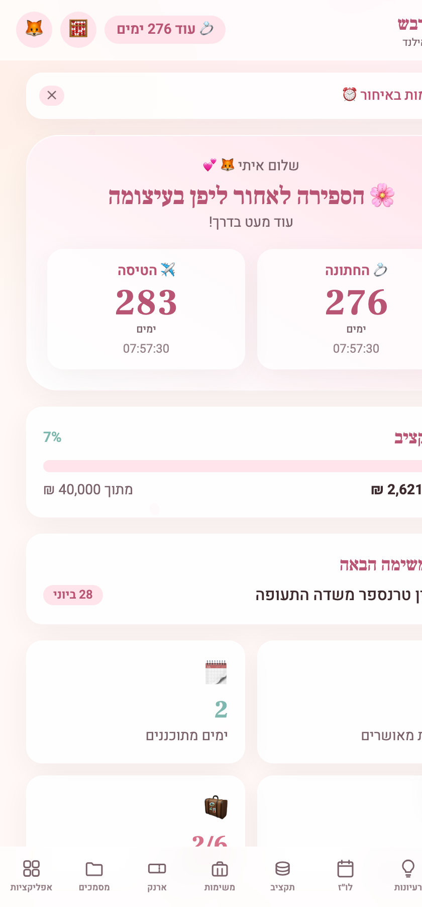
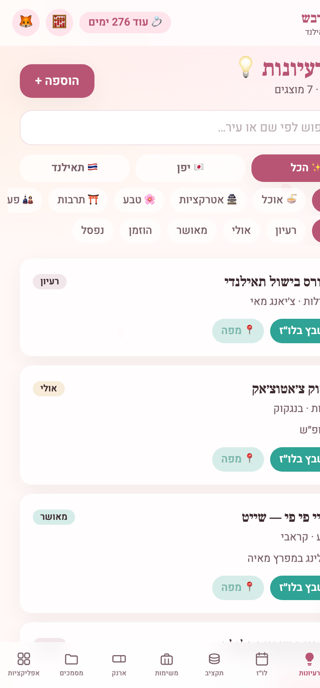
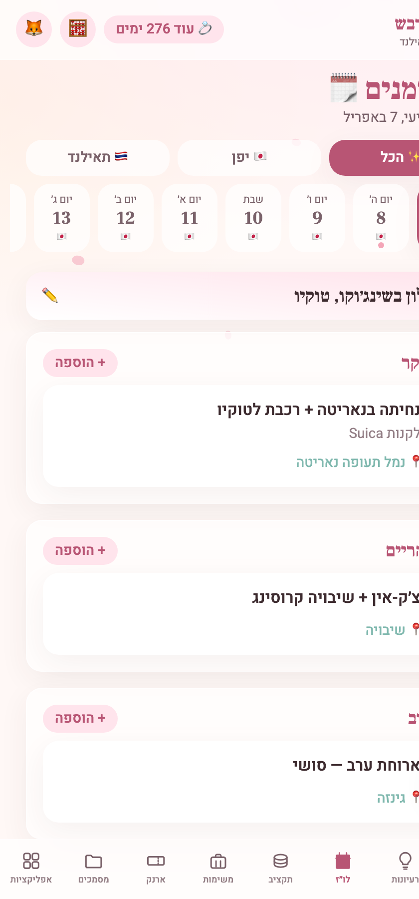
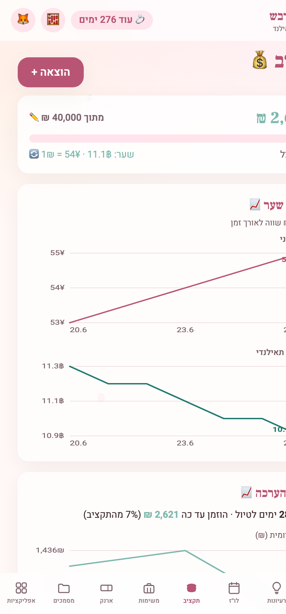
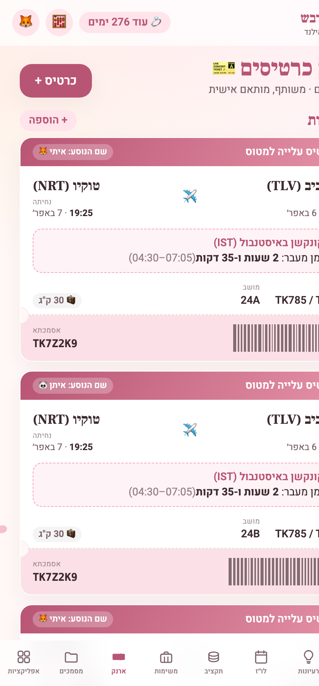
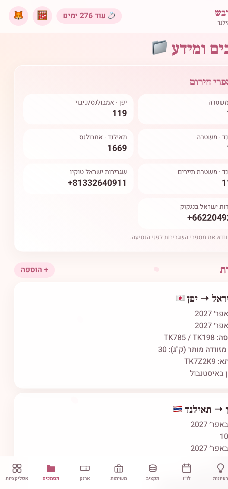
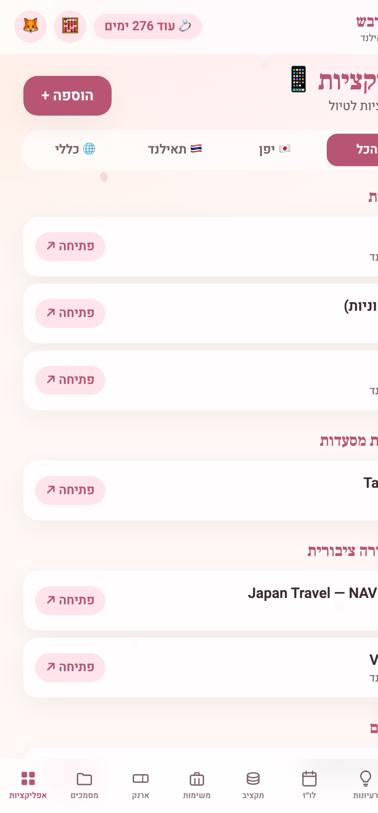

# 🌸 Trip Organizer — a white-label, real-time travel companion

A mobile-first **Progressive Web App** for organizing a multi-destination trip, with
**real-time sync** between phones, a one-file configuration, and a romantic
cherry-blossom (sakura) design out of the box.

It ships configured for **Itay & Eitan's honeymoon** (Japan 🇯🇵 → Thailand 🇹🇭, in Hebrew/RTL),
but it's built as a **template**: change one config file and it becomes *your* trip — your
people, destinations, dates, currencies, budget, colours, and language.

- **Cost:** ₪0 / $0 — runs entirely on Firebase's free "Spark" tier.
- **Stack:** React 19 · Vite · Tailwind CSS v4 · Firebase (Firestore + Auth) · Framer Motion · React Router · `vite-plugin-pwa`.

---

## 📱 What it looks like

A glance at the shipped (demo) configuration — Hebrew/RTL, sakura theme, full real-time data:

<table>
  <tr>
    <td align="center" width="25%"><br><sub><b>🏠 Home</b><br>dual countdown · budget · next task</sub></td>
    <td align="center" width="25%"><br><sub><b>💡 Ideas bank</b><br>filter by place / category / status</sub></td>
    <td align="center" width="25%"><br><sub><b>🗓️ Itinerary</b><br>day-by-day timeline</sub></td>
    <td align="center" width="25%"><br><sub><b>💰 Budget</b><br>multi-currency · split · donut</sub></td>
  </tr>
  <tr>
    <td align="center" width="25%"><br><sub><b>🎫 Travel Wallet</b><br>boarding-pass tickets</sub></td>
    <td align="center" width="25%"><br><sub><b>📁 Documents</b><br>flights · lodging · contacts</sub></td>
    <td align="center" width="25%"><br><sub><b>📱 Useful Apps</b><br>by country & category</sub></td>
    <td align="center" width="25%"></td>
  </tr>
</table>

> These are auto-captured from the running app in demo mode and live in
> [`docs/screenshots/`](docs/screenshots). Once you've made the app yours (§1), regenerate
> them by running `npm run dev:demo` and re-screenshotting.

---

## 🗺️ If you're new here, read this first

There are **three things** to do to make this app yours:

1. **Edit the config file** — `src/config/tripConfig.ts` — to describe your trip. *(no other code changes needed)*
2. **Create a free Firebase project on Google** and paste 6 values into a `.env` file — this is the backend that syncs your data between phones.
3. **Run it** locally, then optionally **deploy** it so it works on your phones.

Everything below walks through these in order. You can also just **preview it instantly with sample data** (step 0) before touching anything.

---

## 0. Preview it right now (no setup, no backend)

Want to see what it looks like before doing anything? There's a **demo mode** with
in-memory sample data and no login:

```bash
npm install
npm run dev:demo
```

Open the URL it prints (usually http://localhost:5173). Nothing is saved in this mode —
it's purely for a first look. (In demo mode you're permanently "logged in" as a demo
user, so the login/logout screens are intentionally unreachable.)

---

## 1. Make it yours — edit `src/config/tripConfig.ts`

**This single file is the source of truth for the whole app.** Open
[`src/config/tripConfig.ts`](src/config/tripConfig.ts) and edit the fields below. The rest
of the app (titles, theme, currencies, security rules, demo data) is *derived* from it
automatically — you do **not** edit component code.

> User-facing text/labels (button copy, screen titles, etc.) live in a companion file,
> [`src/config/content.ts`](src/config/content.ts). Edit it there if you want to change
> wording or translate the UI.

| Section in the config | What you change |
|---|---|
| `branding` | App name, tagline, document title, description, logo emoji, theme colour. |
| `locale` | `language` (e.g. `'he'`, `'en'`), `direction` (`'rtl'` / `'ltr'`), `dateLocale`. |
| `mode.isHoneymoon` | `true` enables the wedding milestone + couple/💕 copy; set `false` for a regular trip. |
| `travellers` | The people on the trip — `id`, `name`, `emoji`. The budget splits N ways between them. |
| `VITE_ALLOWED_EMAILS` *(in `.env`)* | **🔒 The access list.** Only these emails can sign in and see the data (see §3). Kept in `.env`, not the config. |
| `milestones` + `trip` | Key dates (wedding/takeoff/return) and the trip start/end dates. |
| `destinations` | One entry per place: name, flag, dates, `currencyCode`, theme colours, emergency numbers, phrasebook. Add as many as you like. |
| `currencies` | One per currency used; mark the home one `isBase: true`. Live FX rates are fetched automatically, with `fallbackRates` if offline. |
| `budget` | `defaultTotal`, base currency, warning threshold. |
| `theme.colors` / `theme.fonts` | The palette and fonts, injected as CSS variables at boot. |
| `taxonomies` | The dropdown lists: idea/expense/packing/app categories, document types, etc. |

> 💡 **Tip:** if you're just renaming the trip and swapping two destinations, you only
> really need to touch `branding`, `travellers`, `milestones`, `trip`, `destinations`,
> and `currencies` (plus `VITE_ALLOWED_EMAILS` in `.env`). Everything else has defaults.

---

## 2. Create your Firebase backend (on Google — free)

The app stores data in **Cloud Firestore** and signs people in with **Firebase
Authentication**. Both are free for this scale. You set this up once in Google's
**Firebase Console**.

### 2a. Create the project
1. Go to **[Firebase Console](https://console.firebase.google.com)** (sign in with a Google account) → **Add project**.
2. Give it a name, accept the defaults, and finish. *(Google Analytics is optional — you can skip it.)*

### 2b. Register a Web app and copy its config
1. Inside the project, click the **⚙️ gear → Project settings**.
2. Scroll to **Your apps** → click the **Web** icon (`</>`) → register the app (any nickname).
3. Firebase shows a `firebaseConfig = { ... }` snippet. Copy these values into a **`.env`** file in the project root.

Create `.env` by copying the template:

```bash
cp .env.example .env
```

Then fill it in (the keys match the Firebase config snippet 1:1):

```env
VITE_FIREBASE_API_KEY=...
VITE_FIREBASE_AUTH_DOMAIN=...
VITE_FIREBASE_PROJECT_ID=...
VITE_FIREBASE_STORAGE_BUCKET=...
VITE_FIREBASE_MSG_SENDER_ID=...        # "messagingSenderId" in the snippet
VITE_FIREBASE_APP_ID=...
VITE_FIREBASE_MEASUREMENT_ID=...       # optional (enables Analytics)

# Who is allowed in — comma-separated. Kept in .env (out of the repo) so real
# addresses aren't published. Also generates firestore.rules (§3).
VITE_ALLOWED_EMAILS=you@gmail.com,partner@gmail.com
```

> The `VITE_FIREBASE_*` values are **not secrets** — they ship to the browser by design;
> your data is protected by the auth allow-list + Firestore rules (§3), not by hiding them.
> `VITE_ALLOWED_EMAILS` is kept in `.env` mainly so your real addresses stay out of a public
> repo. `.env` is git-ignored — only `.env.example` (placeholders) is committed.

### 2c. Turn on Email/Password sign-in
1. **Authentication** → **Get started** → **Sign-in method** tab → enable **Email/Password**.
2. **Users** tab → **Add user** → create one account per traveller (email + password).
   > Use the **same emails** you put in `VITE_ALLOWED_EMAILS` (§2b / §3).

### 2d. Create the database
**Firestore Database** → **Create database** → choose **Production mode** → pick a region
(e.g. `eur3`). You'll generate & upload the security rules in §3/§5 — until then, production
mode safely denies everything.

---

## 3. 🔒 Security — how access is locked down

Access is controlled by **one env var**: `VITE_ALLOWED_EMAILS` in your (git-ignored) `.env`.

```env
# .env  — comma-separated; kept out of the repo
VITE_ALLOWED_EMAILS=you@gmail.com,partner@gmail.com
```

This single list feeds **two** layers, so keep it accurate:

- **The app "bouncer":** after login, anyone whose email isn't an **exact match** in this
  list lands on an "Unauthorized" screen. (`tripConfig.ts` reads `infra.allowedEmails` from
  this env var.)
- **The Firestore rules:** the database itself rejects reads/writes from any other email —
  the real, server-side guard.

**`firestore.rules` is auto-generated and git-ignored — never hand-edit it.** To change who
has access, edit `VITE_ALLOWED_EMAILS` in `.env` and run:

```bash
npm run generate-rules
```

This rewrites `firestore.rules` from the env var (validating every entry is a real email).
It also runs automatically before every deploy.

#### Generating & deploying the rules

`firestore.rules` is **git-ignored**, so a fresh clone won't contain it — you create it
locally. `npm run generate-rules` reads `VITE_ALLOWED_EMAILS` from `.env` and writes a file
like this:

```js
// firestore.rules  (AUTO-GENERATED — do not edit by hand)
rules_version = '2';
service cloud.firestore {
  match /databases/{database}/documents {
    function isAllowed() {
      return request.auth != null
        && request.auth.token.email in [
          'you@gmail.com',
          'partner@gmail.com'
        ];
    }
    match /{document=**} { allow read, write: if isAllowed(); }
  }
}
```

Then push it to Firebase. Two ways:

```bash
npm run deploy                            # generates rules + builds + deploys rules & site (§5)
# — or, to push ONLY the rules after editing the allow-list (no site rebuild): —
npm run generate-rules
firebase deploy --only firestore:rules
```

> ⚠️ The rules only take effect **after** you deploy them. Editing `.env` alone changes the
> in-app bouncer on your next build, but the database stays on the previously-deployed rules
> until you run a deploy.

> 🔓 **Why an env var?** The bouncer runs client-side, so the allow-list is bundled into the
> deployed JS regardless — this keeps the real addresses out of the **public repo + git
> history** (the easily-scraped vector), not out of the shipped app. Real security is the
> server-side Firestore rules + passwords.

> A note on `register()`: the login screen has a "register" option (open Firebase signup).
> A stranger who registers still can't see anything — they hit the Unauthorized screen and
> the rules deny their data. For a locked-down production app you can disable open sign-up
> in the Firebase console (Authentication → Settings).

---

## 4. Run the real (synced) app locally

Once `.env` is filled in (§2) and auth users exist (§2c):

```bash
npm run dev
```

A login screen appears. Sign in with one of the accounts you created — done. 🎉
Open it on a second device/account and changes sync between them in real time.

| Command | What it does |
|---|---|
| `npm run dev` | Run the real app against your Firebase project. |
| `npm run dev:demo` | Run with in-memory sample data, no backend (preview only). |
| `npm run build` | Production build into `dist/`. |
| `npm run generate-rules` | Regenerate `firestore.rules` from `VITE_ALLOWED_EMAILS` (in `.env`). |
| `npm run deploy` | **Generate rules → build → deploy** to Firebase (see §5). |

---

## 5. Deploy it so it works on your phones (Firebase Hosting)

One-time setup of the Firebase CLI (these commands are interactive — run them yourself):

```bash
npm install -g firebase-tools
firebase login
firebase use --add          # pick the project you created → updates .firebaserc
```

Then, to publish (and on every future update):

```bash
npm run deploy
```

`npm run deploy` automatically runs the `predeploy` step first — it regenerates
`firestore.rules` from `VITE_ALLOWED_EMAILS` (§3), builds the app, then `firebase deploy`
uploads **both** the security rules and the site. When it finishes you'll get a URL like
`https://<your-project-id>.web.app`.

**Install it on a phone (PWA):**
- **iPhone (Safari):** Share → "Add to Home Screen".
- **Android (Chrome):** ⋮ menu → "Install app" / "Add to Home Screen".

It opens full-screen with its own icon, like a native app.

---

## 6. Customizing look & feel

| What | Where |
|---|---|
| Colours, fonts, shadows | `theme` block in [`src/config/tripConfig.ts`](src/config/tripConfig.ts) (injected as CSS variables at boot by `src/lib/applyTheme.js`). |
| Static fallback palette | `@theme` block in [`src/index.css`](src/index.css) (mirrors the config defaults). |
| UI text / translations | [`src/config/content.ts`](src/config/content.ts). |
| Animation intensity / falling petals | `src/lib/motionVariants.js`, `src/components/Petal*.jsx`. |
| Demo (preview) sample data | `src/lib/demoStore.js` (auto-derived from your config). |

---

## 📦 Project structure

```
src/
├─ config/      tripConfig.ts (the trip — your source of truth) + content.ts (UI strings)
├─ lib/         tripConfig.js (derived helpers), firebase, useCollection (sync),
│               applyTheme, currency, motionVariants, demoStore
├─ context/     AuthContext (login / register / the authorization "bouncer")
├─ components/  Layout, BottomNav, Modal, Countdown, Petal* (animations) ...
└─ pages/       Dashboard, Ideas, Itinerary, Budget, Tasks, Wallet, Documents, Apps
scripts/        generate-rules.mjs (firestore.rules generator), generate-icons.mjs
```

**How the config flows:** `src/config/tripConfig.ts` (+ `content.ts`) → derived into the
exact shapes components expect by `src/lib/tripConfig.js` → consumed by pages. Build-time
generators turn the same config into `index.html`/manifest branding and `firestore.rules`.

## 📖 Full configuration reference — every section of `tripConfig.ts`

The config is one big object with the top-level keys below. This is what each section
controls and what's in it for the shipped (Japan→Thailand) trip. Edit values in place — the
app re-derives everything from them.

```
app · mode · locale · branding · travellers · sharedParty · guest · homeCountry
milestones · trip · destinations · currencies · budget · taxonomies · content
infra · settings · theme · seed
```

### `app` — identity & storage keys
App `name`, `version` (currently `2.3.0`), and `storageKeyPrefix` (`'honeymoon'`) used to
namespace localStorage keys (FX-rate cache, "install dismissed" flag, etc.).

### `mode` — what kind of trip + feature switches
- `isHoneymoon` (`true`) — enables the wedding milestone, "Just Married" copy, the 💕 couple tagline.
- `justMarried` — flips to `true` automatically once the wedding date passes.
- `features` — on/off switches for each module: `ideas, itinerary, budget, tasks, wallet, documents, apps`, plus flourishes `petals` (falling-petal particles), `confetti`, `currencyCalculator`, `homeFab` ("take me home" button). All `true` today.

### `locale` — language & layout direction
`language: 'he'`, `direction: 'rtl'`, `dateLocale: 'he-IL'`. Drives `<html lang/dir>` and all date formatting. Set `'en'` / `'ltr'` for an English app.

### `branding` — names, title, colours
`appName`, `shortName`, `tagline` (`יפן · תאילנד`), `description`, `documentTitle` (browser tab + PWA name), `logoEmoji`/`splashEmoji` (🌸), `themeColor` (`#F4A6B8`, browser chrome), `backgroundColor` (`#FFF8F6`, splash).

### `travellers` · `sharedParty` · `guest` — the people
- `travellers` — the trip members; the budget splits **N ways** between them. Each has `id`, `name`, `emoji`, and `matchEmails` (login-email substrings → resolve a user to this person, **cosmetic only**). Currently **Itay 🦊** and **Eitan 🐼**.
- `sharedParty` — the "everyone / shared" pseudo-person (id `both`, **שנינו** 💞) used for shared expenses.
- `guest` — fallback label/emoji (**אורח** 💕) for an unrecognized login.

### `homeCountry` — where you depart from / return to
`israel` 🇮🇱 (`iso: 'IL'`, `currencyCode: 'ILS'`). Drives the base currency, embassy framing, and route titles ("Israel → Japan").

### `milestones` & `trip` — the key dates
- `milestones` — dated events with an emoji, label, and `doneMessage`. `showInCountdown` puts it in the dashboard's dual-countdown; `gatedBy` hides it unless a `mode` flag is on. Currently **💍 wedding** `2027-03-30` (gated by `isHoneymoon`), **✈️ takeoff** `2027-04-06`, **🏠 return** `2027-05-12`.
- `trip` — itinerary bounds (`startDate` `2027-04-07` → `endDate` `2027-05-12`), `year`, and `activeLabel` ("בירח הדבש") shown once all milestones pass.

### `destinations` — the legs (add as many as you want)
An array; the app finds which destination a date belongs to by its inclusive `[startDate, endDate]` range. Each destination has:

| Field | What it is |
|---|---|
| `id`, `name`, `flag`, `iso` | Identity. |
| `currencyCode` | Links to a `currencies[]` entry. |
| `startDate` / `endDate` | The leg's local-date range. |
| `theme` | Per-leg colours: `emoji`, `accent`, `accentStrong`, `chip`, `soft`, `ring`, `gradient` — the whole app re-tints while you're in that leg. |
| `legHero` | Dashboard hero copy while travelling there (`text` + `subTemplate`). |
| `emergencyNumbers[]` | Police / ambulance etc. (shown in Documents). |
| `embassy` | Your country's embassy contact. |
| `phrasebookLang` + `phrasebook[]` | Handy phrases (`he` / `local` / `rom`). |

Currently: **🇯🇵 Japan** (Apr 7–27, JPY, sakura theme, 8 phrases) and **🇹🇭 Thailand** (Apr 28–May 12, THB, jade theme, 8 phrases).

### `currencies` — money & exchange
One entry per currency; the home one has `isBase: true`. Fields: `code`, `symbol`, `label`, `flag`, `fractionDigits`, `linkedDestinationId`, `tipRate` (for the tip calculator), `rateDigits` (FX-ticker precision), `tipNote`. Currently **₪ ILS** (base), **¥ JPY** (Japan, no tipping), **฿ THB** (Thailand, ~10% tip).

### `budget` — totals, thresholds, live FX
`baseCurrency` (`ILS`), `defaultTotal` (`40000`), `warnThreshold` (`0.8` → amber at 80%), `settlementThreshold` (ignore balances under ₪1), `barColors`, `exchangeRateApi` (free `open.er-api.com`, 12 h cache), and `fallbackRates` used offline (`JPY 53.9`, `THB 11.1` per ₪1).

### `taxonomies` — every dropdown / category list
All the picklists across the app, each `{ id, label, emoji }` (some carry colours):

| List | Current entries |
|---|---|
| `ideaCategories` | אוכל 🍜 · אטרקציות 🏯 · טבע 🌸 · תרבות ⛩️ · פעילות 🎎 · קניות 🛍️ · חיי לילה 🌃 |
| `ideaStatuses` | רעיון · אולי · מאושר · הוזמן · נפסל *(approved + booked count toward "approved")* |
| `slots` | בוקר 🌅 · צהריים ☀️ · ערב 🌙 *(itinerary time-of-day)* |
| `packingCategories` | בגדים 👕 · אלקטרוניקה 🔌 · מסמכים 📄 · טיפוח 🧴 · שונות 🎒 |
| `expenseCategories` | אוכל · תחבורה · לינה · פעילויות · קניות · שונות *(each with a chart colour)* |
| `taskTypes` | ✅ משימות · 🧳 אריזה |
| `appCategories` | מוניות 🚕 · מסעדות 🍽️ · תחבורה 🚆 · תרגום 🗣️ · ניווט 🗺️ · **מלונות 🏨 · אטרקציות 🎡 · כללי 📌** |
| `documentTypes` | טיסות ✈️ · רכבות 🚄 · אטרקציות 🎟️ · מסעדות 🍽️ · לינה 🏨 · אנשי קשר 📇 · מידע 📝 — each defines its own form `fields`; `perPassenger` makes one card per traveller, `walletOnly` keeps it in the Wallet. |

### `content` — all user-facing text → `src/config/content.ts`
The `content` key pulls in [`src/config/content.ts`](src/config/content.ts), which holds every
UI string grouped into `common`, `countdown`, `dashboard`, `login`, and `unauthorized`,
plus an `fmt('{x}', { x })` interpolator. **Translate the app by editing that file.**

### `infra` — backend wiring & security
- `allowedEmails` — **the access list** (exact emails allowed in; feeds both the bouncer and `firestore.rules` — see §3). Sourced from `VITE_ALLOWED_EMAILS` in `.env`, so real addresses stay out of the repo.
- `demoMode` / `demoUserEmail` — demo toggle (overridden by `VITE_DEMO`) and the demo identity.
- `collections` — Firestore collection names per feature.
- `firebaseEnvVarNames` / `requiredBackendKeys` — maps Firebase config to the `VITE_FIREBASE_*` env vars.
- `offlinePersistence`, `analyticsEnabled`, `mapsUrlTemplate` (the "open in Maps" link builder).

### `settings` — interaction & timing
`linkScheme` (`https://`), `timings` (undo window, toast duration, long-press delay/tolerance, countdown tick rates), and `haptics.enabled`.

### `theme` — the palette, injected as CSS variables at boot
`colors` (the full sakura palette — cream, petal, sakura, rose, gold, jade, teal, ink…), `fonts` (`Heebo` / `Frank Ruhl Libre`), `shadows` (soft/float/glow), the page `background` gradient, `ticket.perforation` (the boarding-pass tooth pattern), `fallbackAccentDestinationId`, `neutralAccent`, and `statTints` (dashboard stat colours). Mirrored statically in `src/index.css`'s `@theme` block.

### `seed` — one-tap sample data
`flights` (3 sample legs) and `apps` (8 recommended apps) used by the in-app "add recommended…" buttons on empty pages. *(This is separate from the no-backend demo dataset, which lives in `src/lib/demoStore.js`.)*

---

## 💸 About the free tier

Firestore's Spark tier gives ~50K reads / 20K writes per day and 1 GB of storage — far more
than a couple of travellers will ever use. Unlike some free databases, it doesn't "sleep"
after inactivity.

Safe travels! ✈️💕
